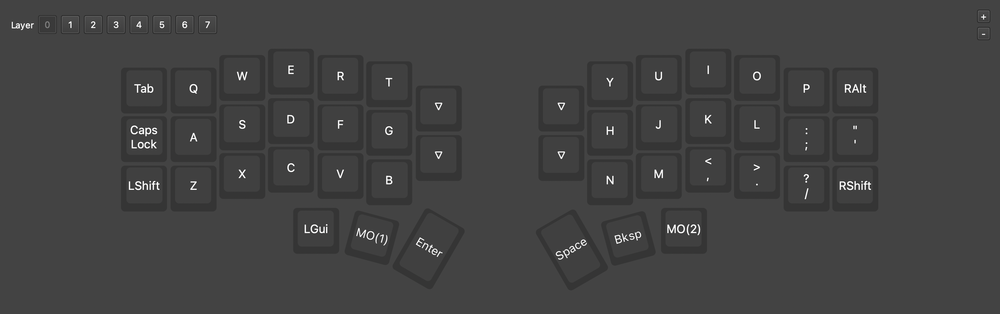
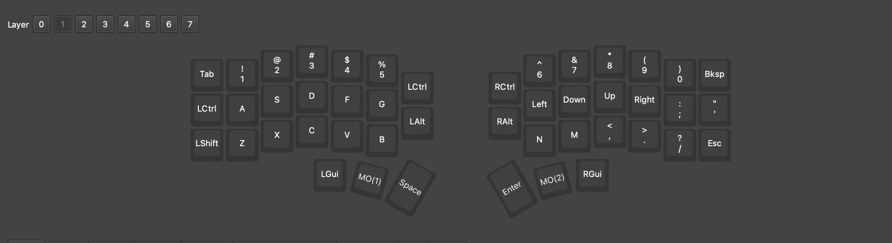
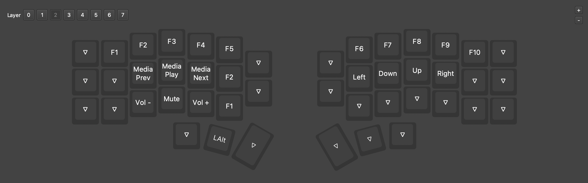

# Corne V4 Keymap

My Vial keymap for the Corne V4 split keyboard, optimised for macOS and vim workflows.

## Layers

### Layer 0 — Base


### Layer 1 — Symbols & Numbers


### Layer 2 — Navigation & Media


## Philosophy

**Stick to defaults.** I use QWERTY and keep shifted symbols in their standard positions. This lets me move between machines without retraining muscle memory.

**Brackets get their own columns.** The right two columns on Layer 1 are dedicated to bracket pairs: `[]`, `{}`, `()`. Numbers are moved to new positions to accommodate this.

**Vim everywhere.** Layer 2 provides arrow keys on `hjkl`, giving vim-style navigation in any text field.

## Setup

### Hardware
- [Corne V4 Wireless 2.4g](https://www.aliexpress.com/store/1102758150) (SZR KBD Store) — ~£50
- Tenting kit — ~£20
- USB-A to USB-C adapter

### Software
1. **[Vial](https://get.vial.today/download/)** — Flash `corne_keymap.vil` to the keyboard
2. **[Karabiner-Elements](https://karabiner-elements.pqrs.org/)** — Import [Caps Lock → Ctrl/Esc](https://ke-complex-modifications.pqrs.org/?q=Change%20caps_lock%20to%20left_control%20if%20pressed%20with%20other%20keys%2C%20change%20caps_lock%20to%20escape%20if%20pressed%20alone.#caps_lock_tapped_escape_held_left_control) rule

## Files

```
├── corne_keymap.vil    # Vial keymap (import via Vial app)
├── images/
│   ├── layer0-base.png
│   ├── layer1-symbols.png
│   └── layer2-nav.png
└── README.md
```
